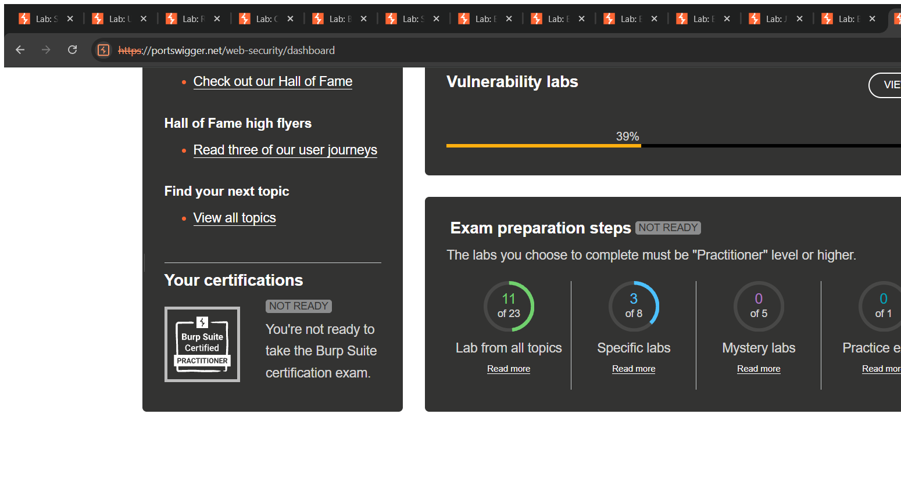
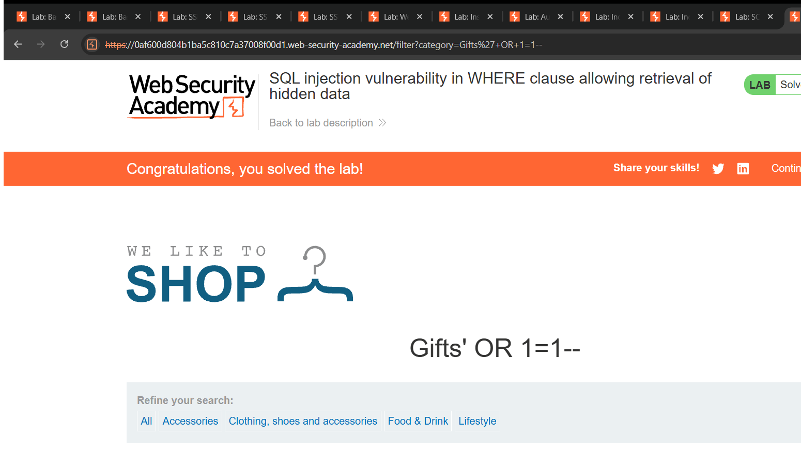
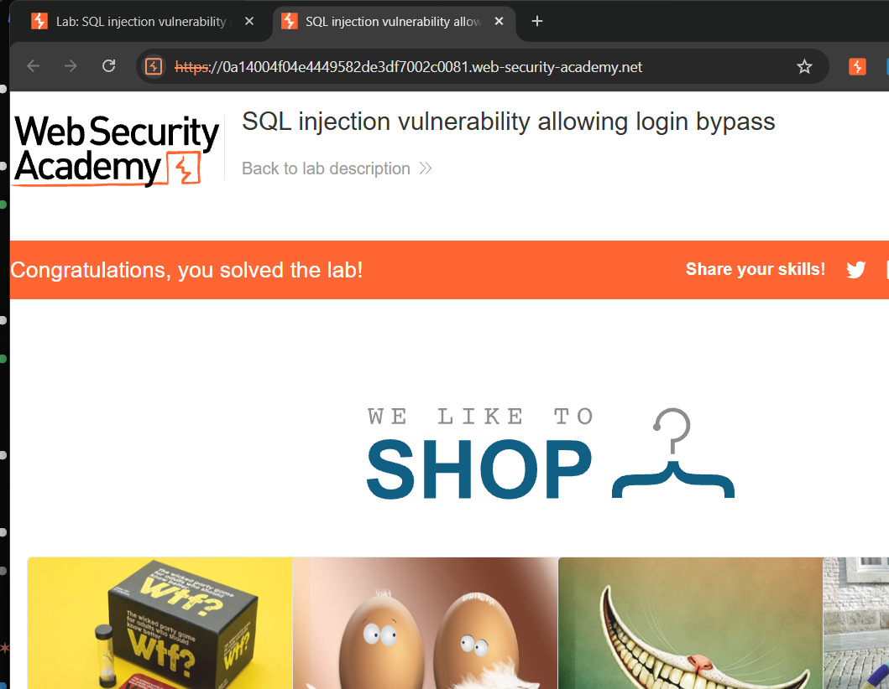

# SQL Injection — Technical Writeups

> Topic requirement: at least 14 labs solved, at least 2 technical writeups. The two writeups below cover the two foundational SQLi classes I solved.



---

## Writeup 1 — SQL Injection in WHERE clause allowing retrieval of hidden data

**Vulnerability Name:** SQL Injection (in-band, WHERE clause)
**Lab:** SQL injection vulnerability in WHERE clause allowing retrieval of hidden data
**Lab URL:** https://portswigger.net/web-security/sql-injection/lab-retrieve-hidden-data

### Description
The shop filters products by category. When I pick a category, the app builds a SQL query and drops the category value straight into the `WHERE` clause without using a parameterized query. Because my input is treated as part of the SQL code (not just data), I can change what the query does. The backend query looks like:

```sql
SELECT * FROM products WHERE category = 'Gifts' AND released = 1
```

Only released products in that category are meant to be shown. By injecting SQL into the `category` parameter I can make the condition always true and comment out the `released = 1` check, so the database returns every product, including unreleased/hidden ones.

### Steps to Exploit
1. Open the lab and click any product category (e.g. "Gifts"). The URL becomes `/filter?category=Gifts`.
2. Edit the `category` parameter in the address bar to inject the payload.
3. Send the request.
4. The page now lists products from **all** categories, including hidden/unreleased ones — the lab is marked solved.

### Proof of Concept
**Payload (in the `category` parameter):**
```
'+OR+1=1--
```
**Final URL:**
```
/filter?category=Gifts'+OR+1=1--
```
**Original query:**
```sql
SELECT * FROM products WHERE category = 'Gifts' AND released = 1
```
**Resulting query after injection:**
```sql
SELECT * FROM products WHERE category = 'Gifts' OR 1=1--' AND released = 1
```
The single quote closes the string, `OR 1=1` forces every row to match, and `--` comments out the rest of the query (`AND released = 1`), so unreleased products are revealed.

### Screenshot


### Impact
- **Information Disclosure** — attackers can read data the application intended to hide.
- This same injection point can be escalated to dump entire tables (UNION attacks) or extract credentials, so the real-world impact ranges up to full database compromise.

### Recommended Remediation
- Use **parameterized queries / prepared statements** so user input is always treated as data, never as SQL code.
- Apply **server-side input validation** (allow-list of valid category names).
- Apply **least privilege** to the database account so even a successful injection has limited reach.

### CVSS
**CVSS v3.1: 7.5 (High)** — `AV:N/AC:L/PR:N/UI:N/S:U/C:H/I:N/A:N`
Remotely exploitable over the network, no privileges or user interaction, leading to high confidentiality impact (disclosure of hidden data).

---

## Writeup 2 — SQL Injection allowing login bypass

**Vulnerability Name:** SQL Injection (authentication bypass)
**Lab:** SQL injection vulnerability allowing login bypass
**Lab URL:** https://portswigger.net/web-security/sql-injection/lab-login-bypass

### Description
The login form puts the submitted **username** directly into the authentication SQL query. Because the username is concatenated into the query string, I can inject a comment sequence that removes the password check entirely, letting me log in as any user (here, `administrator`) without knowing the password. The backend query looks like:

```sql
SELECT * FROM users WHERE username = 'administrator' AND password = 'mypassword'
```

### Steps to Exploit
1. Open the lab and go to **My account → Log in**.
2. In the **Username** field enter the payload below; put anything in the **Password** field.
3. Submit the form.
4. I'm logged in as `administrator` — the lab is solved.

### Proof of Concept
**Username field:**
```
administrator'--
```
**Password field:** `anything`

**Resulting query:**
```sql
SELECT * FROM users WHERE username = 'administrator'--' AND password = 'anything'
```
The `'` closes the username string and `--` comments out everything after it, including `AND password = '...'`. The database matches the `administrator` row and the password is never checked.

### Screenshot


### Impact
- **Authentication Bypass** — logging in as an arbitrary/admin user without credentials.
- Leads directly to **account takeover** and, for an admin account, full control of the application.

### Recommended Remediation
- Use **parameterized queries** for the authentication lookup.
- Verify passwords using a **salted hash comparison** in application code rather than inside the SQL `WHERE` clause.
- Add input validation and generic error messages.

### CVSS
**CVSS v3.1: 9.8 (Critical)** — `AV:N/AC:L/PR:N/UI:N/S:U/C:H/I:H/A:H`
Remote, unauthenticated, trivial complexity, resulting in full account/administrator takeover (high confidentiality, integrity and availability impact).
