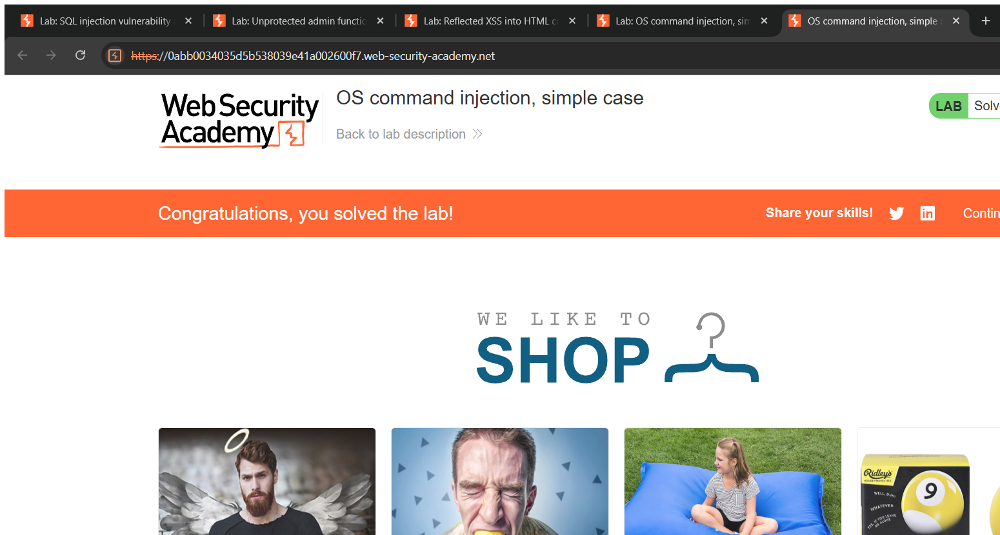
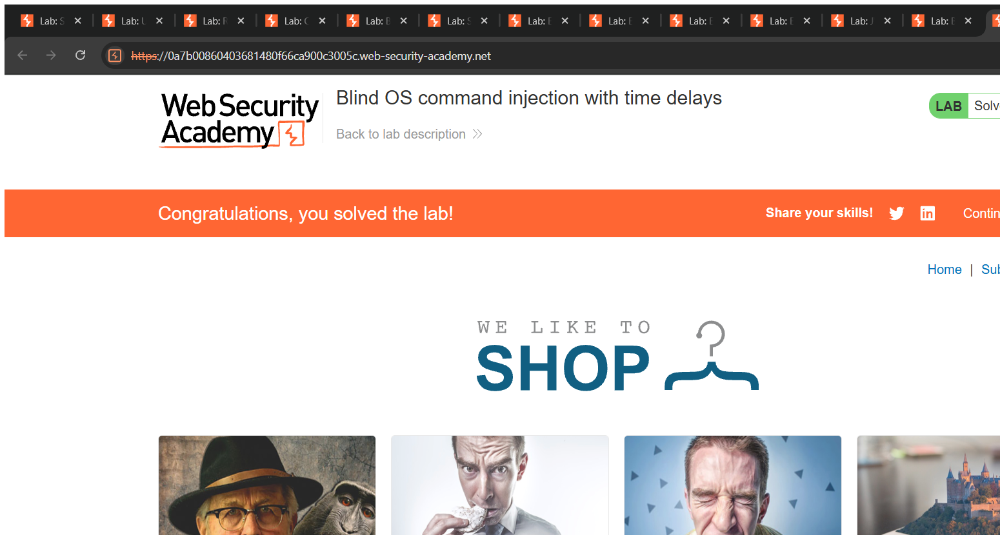

# OS Command Injection — Technical Writeups

> Topic requirement: 3 labs solved (all non-exempted), at least 2 technical writeups.

---

## Writeup 1 — OS Command Injection, simple case

**Vulnerability Name:** OS Command Injection (in-band)
**Lab:** OS command injection, simple case
**Lab URL:** https://portswigger.net/web-security/os-command-injection/lab-simple

### Description
The product stock checker runs a shell command on the server using the `productId` and `storeId` values from the request. The application passes my input into the shell without sanitising it, so I can add my own command using a shell metacharacter. Whatever I append runs with the privileges of the web application and the output is returned to me in the response.

### Steps to Exploit
1. On a product page, click **Check stock**.
2. Capture the resulting `POST /product/stock` request (Burp Proxy → HTTP history → Send to Repeater).
3. Find the `storeId` parameter in the body and append a shell command after a pipe character.
4. Send the request — the output of my injected command (`whoami`) is returned where the stock count normally appears. Lab solved.

### Proof of Concept
**Payload (in the `storeId` parameter):**
```
1|whoami
```
The pipe `|` tells the shell to also run the second command. The application meant to check stock for store `1`, but the shell additionally runs `whoami` and prints the result (e.g. `peter-XXXX`) in the response.

### Screenshot


### Impact
- **Remote Code Execution** — arbitrary OS commands run on the server.
- Full server compromise is possible: read/modify files, pivot into internal systems, install malware, exfiltrate data.

### Recommended Remediation
- Avoid calling the OS shell from application code wherever possible; use safe built-in APIs.
- If a system command is unavoidable, **never** build it from user input — pass arguments via a parameterised API that does not invoke a shell, and use a strict allow-list for values.
- Run the service with **least privilege**.

### CVSS
**CVSS v3.1: 9.8 (Critical)** — `AV:N/AC:L/PR:N/UI:N/S:U/C:H/I:H/A:H`
Remote, unauthenticated arbitrary command execution leading to complete compromise of confidentiality, integrity and availability.

---

## Writeup 2 — Blind OS Command Injection with time delays

**Vulnerability Name:** Blind OS Command Injection (time-based)
**Lab:** Blind OS command injection with time delays
**Lab URL:** https://portswigger.net/web-security/os-command-injection/lab-blind-time-delays

### Description
The feedback form runs a shell command using the submitted details, but unlike the simple case the **output is not returned** in the response ("blind"). I can still prove the injection works — and that commands execute — by injecting a command that makes the server pause for a measurable amount of time. If the response is delayed, the command ran.

### Steps to Exploit
1. Open **Submit feedback**, fill all fields, and submit.
2. Capture the `POST /feedback/submit` request and send it to Repeater.
3. Replace the `email` parameter value with a payload that makes the server ping itself 10 times (~10 seconds).
4. Send — the response takes ~10 seconds instead of being instant, proving command execution. Lab solved.

### Proof of Concept
**Payload (in the `email` parameter):**
```
x||ping+-c+10+127.0.0.1||
```
`ping -c 10 127.0.0.1` pings the loopback address 10 times, taking roughly 10 seconds. `||` runs my command if the preceding part fails, and `+` represents a space in the URL-encoded form body. A ~10-second response confirms the injection.

### Screenshot


### Impact
- **Remote Code Execution** (blind) — even with no visible output, an attacker can run commands, then escalate to output redirection or out-of-band exfiltration to retrieve results, leading to full server compromise.

### Recommended Remediation
- Same as above: do not pass user input into shell commands; use safe APIs with parameterised arguments and strict allow-listing; run with least privilege.

### CVSS
**CVSS v3.1: 9.8 (Critical)** — `AV:N/AC:L/PR:N/UI:N/S:U/C:H/I:H/A:H`
Blind but still arbitrary command execution; full compromise is achievable, so impact is rated the same as the in-band case.
