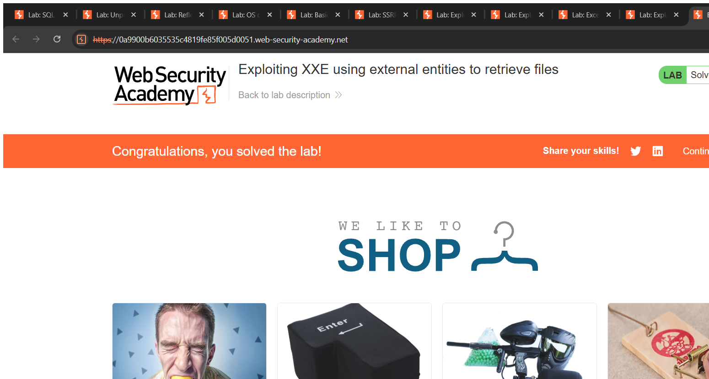
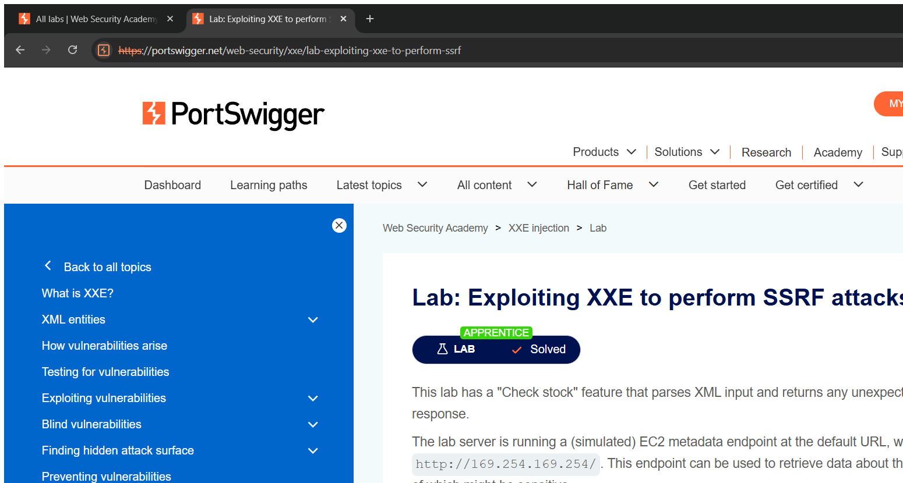

# XML External Entity (XXE) Injection — Technical Writeups

> Topic requirement: 6 labs solved, at least 2 technical writeups.

---

## Writeup 1 — Exploiting XXE using external entities to retrieve files

**Vulnerability Name:** XML External Entity Injection (file disclosure)
**Lab:** Exploiting XXE using external entities to retrieve files
**Lab URL:** https://portswigger.net/web-security/xxe/lab-exploiting-xxe-to-retrieve-files

### Description
The "Check stock" feature submits XML to the server, and the XML parser is configured to process **external entities** (DTDs are not disabled). This lets me define a custom entity that points at a local file on the server. When the parser expands the entity, the file's contents are placed into the response, allowing me to read arbitrary server files such as `/etc/passwd`.

### Steps to Exploit
1. On a product page, click **Check stock** and capture the `POST /product/stock` request (XML body).
2. Add a `DOCTYPE` defining an external entity that references `file:///etc/passwd`.
3. Replace the value inside the `<productId>` element with a reference to that entity (`&xxe;`).
4. Send the request — the contents of `/etc/passwd` are reflected back in the error/response. Lab solved.

### Proof of Concept
**Payload (XML body):**
```xml
<?xml version="1.0" encoding="UTF-8"?>
<!DOCTYPE stockCheck [ <!ENTITY xxe SYSTEM "file:///etc/passwd"> ]>
<stockCheck><productId>&xxe;</productId><storeId>1</storeId></stockCheck>
```
The parser resolves `&xxe;` to the file contents, which appear in the response where the product ID is echoed.

### Screenshot


### Impact
- **Information Disclosure** — read arbitrary files (config files, source code, credentials, keys).
- Often a stepping stone to SSRF and remote code execution depending on the environment.

### Recommended Remediation
- **Disable DTDs and external entities** in the XML parser (the single most effective fix).
- If DTDs are required, disable external entity resolution specifically.
- Prefer less complex data formats (e.g. JSON) where XML is not needed.

### CVSS
**CVSS v3.1: 7.5 (High)** — `AV:N/AC:L/PR:N/UI:N/S:U/C:H/I:N/A:N`
Remote, unauthenticated disclosure of sensitive server-side files.

---

## Writeup 2 — Exploiting XXE to perform SSRF attacks

**Vulnerability Name:** XML External Entity Injection (SSRF)
**Lab:** Exploiting XXE to perform SSRF attacks
**Lab URL:** https://portswigger.net/web-security/xxe/lab-exploiting-xxe-to-perform-ssrf-attacks

### Description
The same XML stock-check feature processes external entities. Instead of pointing the entity at a local file, I point it at an internal URL. The server-side parser fetches that URL, turning the XXE into a Server-Side Request Forgery (SSRF). Here the goal is to reach the cloud metadata endpoint (`http://169.254.169.254/`) and read sensitive instance data.

### Steps to Exploit
1. Capture the `POST /product/stock` XML request.
2. Define an external entity whose `SYSTEM` URL is the internal metadata service.
3. Reference it via `&xxe;` in `<productId>`.
4. Send — the response contains the metadata content. Drill into the path (e.g. `/latest/meta-data/iam/security-credentials/admin`) to retrieve the credentials. Lab solved.

### Proof of Concept
**Payload (XML body):**
```xml
<?xml version="1.0" encoding="UTF-8"?>
<!DOCTYPE stockCheck [ <!ENTITY xxe SYSTEM "http://169.254.169.254/latest/meta-data/"> ]>
<stockCheck><productId>&xxe;</productId><storeId>1</storeId></stockCheck>
```
The parser makes a server-side HTTP request to the metadata IP and returns the response to me.

### Screenshot


### Impact
- **SSRF / Information Disclosure** — reach internal-only services (cloud metadata, internal APIs), often exposing credentials and enabling lateral movement.

### Recommended Remediation
- Disable external entities/DTD processing in the XML parser.
- Network-level controls: block application access to the metadata IP and internal ranges.

### CVSS
**CVSS v3.1: 8.6 (High)** — `AV:N/AC:L/PR:N/UI:N/S:C/C:H/I:N/A:N`
Remote, unauthenticated SSRF reaching internal services; scope changes because the impact extends beyond the vulnerable component to internal systems.
