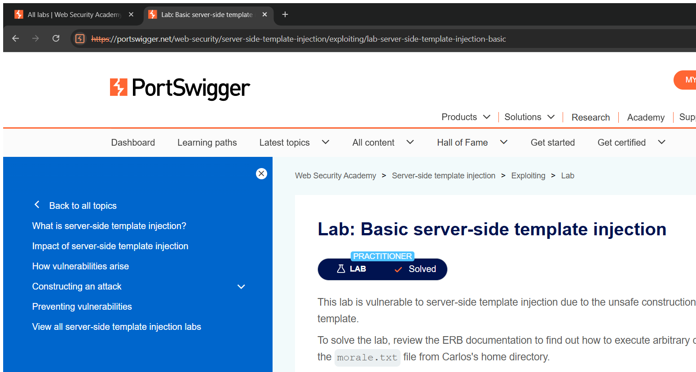
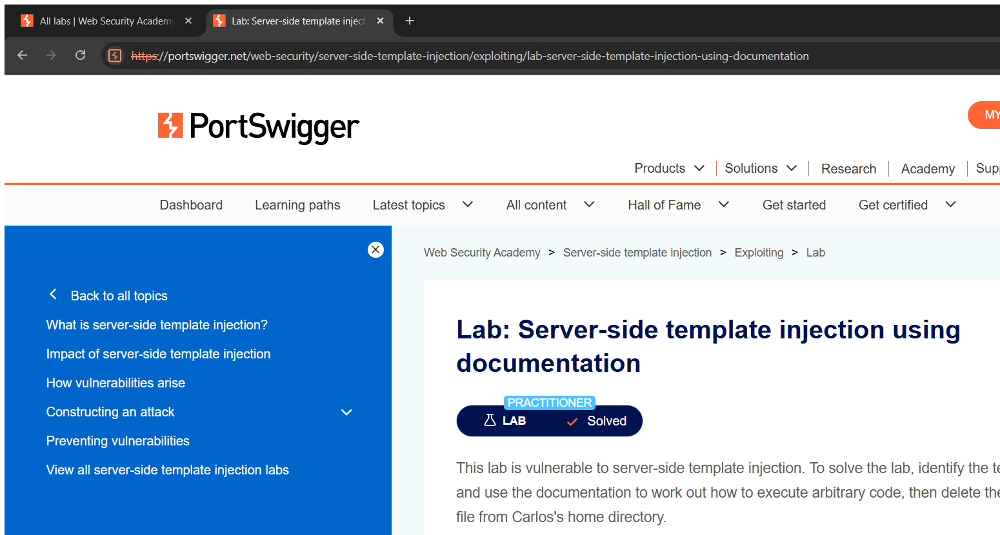

# Server-Side Template Injection (SSTI) — Technical Writeups

> Topic requirement: at least 5 labs solved, at least 2 technical writeups.

---

## Writeup 1 — Basic server-side template injection

**Vulnerability Name:** Server-Side Template Injection (ERB / Ruby)
**Lab:** Basic server-side template injection
**Lab URL:** https://portswigger.net/web-security/server-side-template-injection/exploiting/lab-server-side-template-injection-basic

### Description
The application uses a server-side template engine (ERB, Ruby) and embeds user-controllable input directly into a template that is then rendered. Because my input becomes part of the template source, I can inject template syntax that the engine evaluates server-side, which leads to arbitrary code execution. The vulnerable parameter is the `message` shown for an out-of-stock product, passed via the `ViewMessage` / template render.

### Steps to Exploit
1. View an out-of-stock product — its name/message is rendered through a template.
2. Confirm the engine by injecting a math expression and seeing it evaluated.
3. Inject ERB syntax that runs a system command to delete the target file `morale.txt` from Carlos's home directory.
4. Send — the file is deleted and the lab is solved.

### Proof of Concept
**Confirmation (evaluates to 49):**
```
<%= 7*7 %>
```
**Final payload (deletes the target file):**
```
<%= system("rm morale.txt") %>
```
The `<%= ... %>` ERB tag is evaluated by the Ruby template engine, and `system()` runs the OS command.

### Screenshot


### Impact
- **Remote Code Execution** — full control over the server through the template engine.

### Recommended Remediation
- Never pass user input into a template as template **code**. Pass it only as **data** to a pre-defined template.
- Use a logic-less / sandboxed template engine and keep user data out of the template source.

### CVSS
**CVSS v3.1: 9.8 (Critical)** — `AV:N/AC:L/PR:N/UI:N/S:U/C:H/I:H/A:H`
Remote, unauthenticated code execution.

---

## Writeup 2 — Server-side template injection using documentation (FreeMarker)

**Vulnerability Name:** Server-Side Template Injection (FreeMarker / Java)
**Lab:** Server-side template injection using documentation
**Lab URL:** https://portswigger.net/web-security/server-side-template-injection/exploiting/lab-server-side-template-injection-using-documentation

### Description
A logged-in content manager can edit a product template. The template engine is **FreeMarker** (Java). FreeMarker exposes a built-in (`new`) that can instantiate arbitrary classes, including one that executes OS commands. By reading the engine's documentation I built a payload that creates an `Execute` object and runs a command on the server.

### Steps to Exploit
1. Log in as the content manager (`content-manager : C0nt3ntM4n4g3r`) and open the product template editor.
2. Confirm the engine with `${7*7}` (renders `49`).
3. Use FreeMarker's `?api.new` / `freemarker.template.utility.Execute` to run an OS command that deletes the target file.
4. Save the template — the command runs and the lab is solved.

### Proof of Concept
**Confirmation:**
```
${7*7}
```
**Final payload:**
```
<#assign ex="freemarker.template.utility.Execute"?new()>${ex("rm /home/carlos/morale.txt")}
```
FreeMarker's `Execute` utility runs the shell command server-side.

### Screenshot


### Impact
- **Remote Code Execution** via the template engine, with the privileges of the application.

### Recommended Remediation
- Disable or restrict dangerous built-ins (`Execute`, `?new`) in FreeMarker configuration.
- Do not allow untrusted users to edit raw templates; separate template logic from user-supplied data.

### CVSS
**CVSS v3.1: 8.8 (High)** — `AV:N/AC:L/PR:L/UI:N/S:U/C:H/I:H/A:H`
Requires a low-privileged authenticated user (content manager) but yields full code execution.
