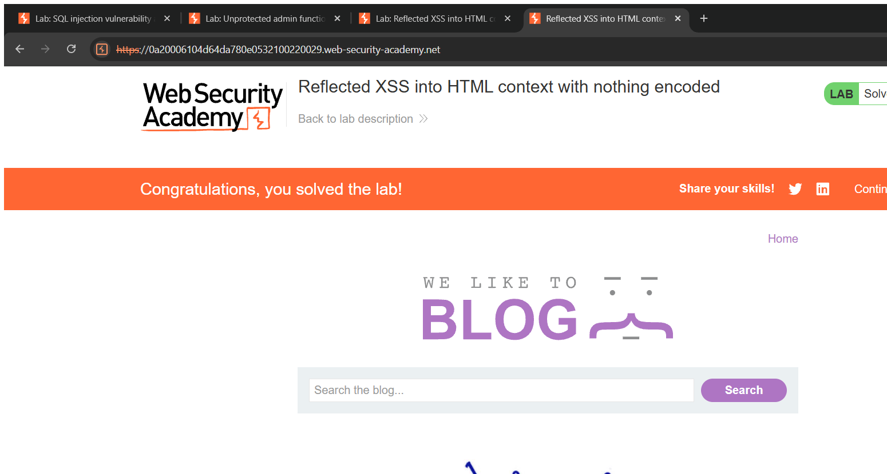
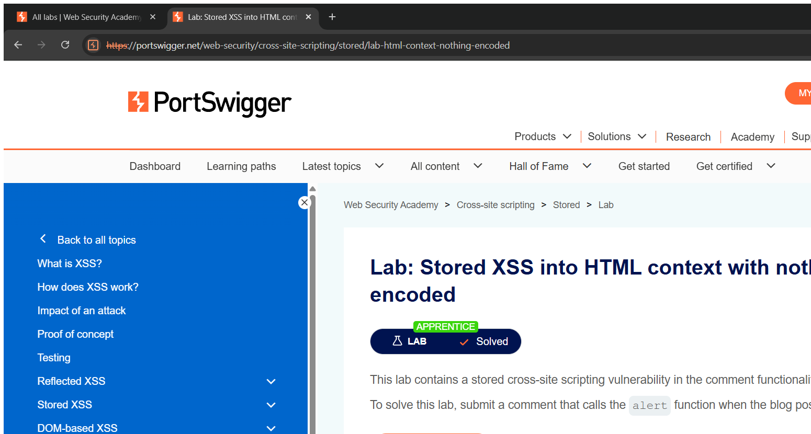

# Cross-Site Scripting (XSS) — Technical Writeups

> Topic requirement: at least 24 labs solved, at least 2 technical writeups.

---

## Writeup 1 — Reflected XSS into HTML context with nothing encoded

**Vulnerability Name:** Reflected Cross-Site Scripting
**Lab:** Reflected XSS into HTML context with nothing encoded
**Lab URL:** https://portswigger.net/web-security/cross-site-scripting/reflected/lab-html-context-nothing-encoded

### Description
The blog search feature reflects the search term straight back into the HTML response without any encoding or filtering. Because my input is placed into the page as raw HTML, I can submit a `<script>` tag that the victim's browser parses and executes. This is a **reflected** XSS — the payload travels in the request and is echoed in the immediate response.

### Steps to Exploit
1. Open the lab and find the search box.
2. Enter a script payload as the search term and submit.
3. The payload is reflected unencoded into the results page and executes — the `alert` dialog fires and the lab is solved.

### Proof of Concept
**Search box / `search` parameter:**
```html
<script>alert(1)</script>
```
The term is reflected verbatim into the HTML, so the browser runs the script.

### Screenshot


### Impact
- **Cross-Site Scripting** — execute arbitrary JavaScript in a victim's browser: steal session cookies, perform actions as the victim, capture keystrokes/credentials, deface content.

### Recommended Remediation
- **Context-aware output encoding** of all user input when writing it into HTML.
- A strong **Content Security Policy (CSP)** as defence-in-depth.
- Validate/sanitise input where appropriate.

### CVSS
**CVSS v3.1: 6.1 (Medium)** — `AV:N/AC:L/PR:N/UI:R/S:C/C:L/I:L/A:N`
Reflected XSS requires victim interaction (clicking a crafted link); scope changes as it executes in the victim's browser context.

---

## Writeup 2 — Stored XSS into HTML context with nothing encoded

**Vulnerability Name:** Stored Cross-Site Scripting
**Lab:** Stored XSS into HTML context with nothing encoded
**Lab URL:** https://portswigger.net/web-security/cross-site-scripting/stored/lab-html-context-nothing-encoded

### Description
The blog comment function saves a comment and later renders it to every visitor of the post without encoding it. Because the stored comment is output as raw HTML, a `<script>` tag I post is executed in the browser of **anyone** who views the post — this is **stored** (persistent) XSS, which is more dangerous than reflected because no per-victim crafted link is needed.

### Steps to Exploit
1. Open a blog post and go to the comment form.
2. Put a script payload in the **comment** field; fill name/email/website with any valid values.
3. Submit the comment, then view the post.
4. The stored script executes on page load — `alert` fires and the lab is solved.

### Proof of Concept
**Comment field:**
```html
<script>alert(1)</script>
```
The comment is stored and rendered unencoded, so it runs for every viewer.

### Screenshot


### Impact
- **Persistent Cross-Site Scripting** — affects all users who view the page; can hijack admin sessions, spread worm-like, and perform mass account takeover.

### Recommended Remediation
- HTML-encode stored user content on output (context-aware).
- Sanitise rich input with a vetted library (e.g. allow-list HTML sanitiser).
- Apply CSP as defence-in-depth.

### CVSS
**CVSS v3.1: 6.4 (Medium)** — `AV:N/AC:L/PR:L/UI:R/S:C/C:L/I:L/A:N`
Persistent and triggered automatically when victims view the page; higher practical risk than reflected XSS.
