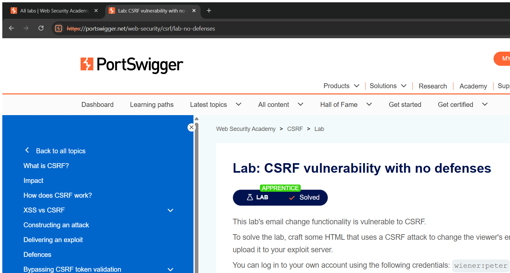
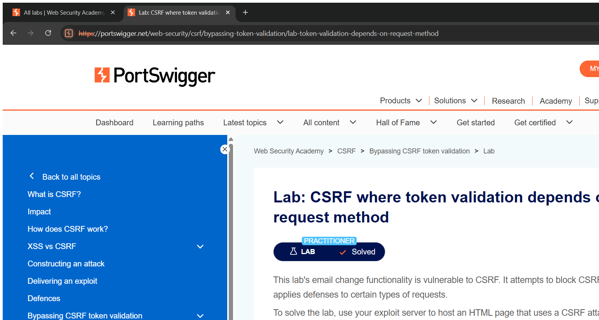

# Cross-Site Request Forgery (CSRF) — Technical Writeups

> Topic requirement: at least 8 labs solved, at least 2 technical writeups.

---

## Writeup 1 — CSRF vulnerability with no defenses

**Vulnerability Name:** Cross-Site Request Forgery
**Lab:** CSRF vulnerability with no defenses
**Lab URL:** https://portswigger.net/web-security/csrf/lab-no-defenses

### Description
The "change email" function accepts a state-changing `POST` request and relies **only** on the session cookie to identify the user — there is no CSRF token or other unpredictable value in the request. Because the browser automatically attaches the session cookie to any request to the site, I can host a malicious page that auto-submits a forged "change email" form. When a logged-in victim visits my page, their browser sends the request with their cookie, changing their email without their consent.

### Steps to Exploit
1. Log in as `wiener : peter` and inspect the `POST /my-account/change-email` request — note it has no CSRF token.
2. On the exploit server, host an HTML page with a hidden form that auto-submits to the change-email endpoint with an attacker-chosen email.
3. Click **Deliver exploit to victim** — the victim's email is changed. Lab solved.

### Proof of Concept
**Exploit page (hosted on the exploit server):**
```html
<form action="https://YOUR-LAB-ID.web-security-academy.net/my-account/change-email" method="POST">
  <input type="hidden" name="email" value="attacker@evil.com">
</form>
<script>document.forms[0].submit();</script>
```
The form auto-submits cross-site; the browser includes the victim's session cookie.

### Screenshot


### Impact
- **Cross-Site Request Forgery** — perform state-changing actions as the victim (change email → trigger password reset → account takeover).

### Recommended Remediation
- Implement **anti-CSRF tokens** (unpredictable, per-session, validated server-side) on all state-changing requests.
- Set `SameSite=Lax` or `Strict` on session cookies.

### CVSS
**CVSS v3.1: 6.5 (Medium)** — `AV:N/AC:L/PR:N/UI:R/S:U/C:N/I:H/A:N`
Requires victim to visit a page; results in integrity impact (unauthorised account change).

---

## Writeup 2 — CSRF where token validation depends on request method

**Vulnerability Name:** Cross-Site Request Forgery (method-based validation bypass)
**Lab:** CSRF where token validation depends on request method
**Lab URL:** https://portswigger.net/web-security/csrf/bypassing-token-validation/lab-token-validation-depends-on-request-method

### Description
The change-email endpoint **does** use a CSRF token, but the server only validates it for `POST` requests. If the same request is sent as a `GET`, the token is not checked at all. This inconsistent validation lets me bypass the protection by simply switching the HTTP method.

### Steps to Exploit
1. Observe the `POST /my-account/change-email` request includes a `csrf` parameter that is validated.
2. Re-send the same request as a `GET` with the parameters in the query string, omitting/forging the token — it succeeds.
3. Build an exploit page that triggers the `GET` request cross-site and deliver it to the victim. Lab solved.

### Proof of Concept
**Exploit page:**
```html
<form action="https://YOUR-LAB-ID.web-security-academy.net/my-account/change-email" method="GET">
  <input type="hidden" name="email" value="attacker@evil.com">
</form>
<script>document.forms[0].submit();</script>
```
Because the server skips token validation for `GET`, the email change goes through with no valid token.

### Screenshot


### Impact
- **CSRF** leading to unauthorised account changes / account takeover, despite a (partially implemented) token defence.

### Recommended Remediation
- Validate the CSRF token for **every** state-changing method, not just `POST`.
- Reject state-changing actions sent via `GET`.
- Use `SameSite` cookies as defence-in-depth.

### CVSS
**CVSS v3.1: 6.5 (Medium)** — `AV:N/AC:L/PR:N/UI:R/S:U/C:N/I:H/A:N`
Same outcome as an unprotected CSRF because the existing defence is trivially bypassed.
