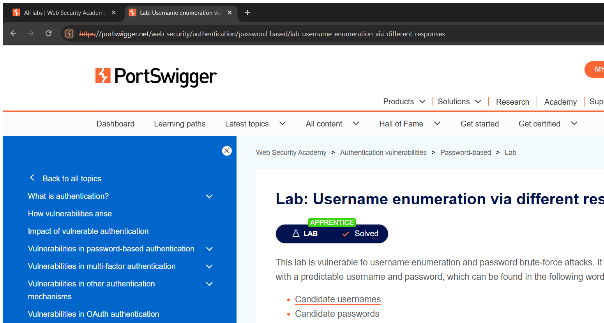
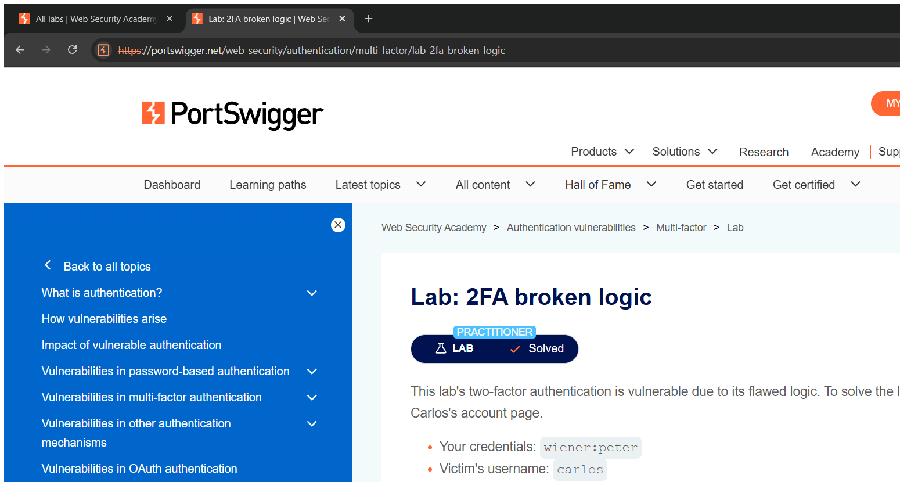

# Authentication Vulnerabilities — Technical Writeups

> Topic requirement: at least 7 labs solved, at least 2 technical writeups.

---

## Writeup 1 — Username enumeration via different responses

**Vulnerability Name:** Username Enumeration + Brute-force
**Lab:** Username enumeration via different responses
**Lab URL:** https://portswigger.net/web-security/authentication/password-based/lab-username-enumeration-via-different-responses

### Description
The login function returns a **different error message** depending on whether the username exists ("Invalid username" vs "Incorrect password"). This difference lets an attacker enumerate valid usernames. Once a valid username is known, the same lack of rate-limiting allows brute-forcing its password from a wordlist.

### Steps to Exploit
1. Capture the `POST /login` request and send it to Intruder.
2. **Enumerate usernames:** cycle a username wordlist; the valid account returns a different/last-distinct response ("Incorrect password" instead of "Invalid username").
3. **Brute-force the password:** fix the discovered username and cycle a password wordlist; the correct password returns a `302` redirect.
4. Log in with the recovered credentials and load **My account** to register the solve.

### Proof of Concept
- Valid username found by response difference: e.g. `acid`
- Password found by brute-force: e.g. `cheese`
- Final login: `acid : cheese` → 302 to `/my-account`.

### Screenshot

### Impact
- **Information Disclosure + Authentication Bypass** — valid usernames are leaked and accounts are compromised through unthrottled brute-force.

### Recommended Remediation
- Return **identical, generic** error messages and response timing for all failed logins.
- Enforce **rate limiting / account lockout / CAPTCHA** and MFA.

### CVSS
**CVSS v3.1: 9.8 (Critical)** — `AV:N/AC:L/PR:N/UI:N/S:U/C:H/I:H/A:H`
Leads to full account takeover of an unauthenticated attacker.

---

## Writeup 2 — 2FA broken logic

**Vulnerability Name:** Broken Two-Factor Authentication Logic
**Lab:** 2FA broken logic
**Lab URL:** https://portswigger.net/web-security/authentication/multi-factor/lab-2fa-broken-logic

### Description
The two-factor step is tied to a client-controlled `verify` cookie instead of the authenticated session. After the password step, the server decides **whose** 2FA code to check based on the `verify` cookie value. By setting `verify=carlos` I can request a 2FA code to be generated for the victim and then brute-force the 4-digit code — all without ever knowing Carlos's password. There is no lockout on the code attempts, so 0000–9999 can be tried exhaustively.

### Steps to Exploit
1. Log in with my own account to learn the flow: `POST /login` sets `verify=<user>` and redirects to `/login2` (the 4-digit code page).
2. Set the `verify` cookie to `carlos` and request `GET /login2` — this generates and emails a code to Carlos.
3. Brute-force `POST /login2` with `mfa-code` from `0000` to `9999` (keeping `verify=carlos`). The correct code returns a `302` to `/my-account`.
4. Use the resulting session to load Carlos's account — lab solved.

### Proof of Concept
- Cookie: `verify=carlos`
- Brute-forced code (this instance): `mfa-code=0080` → `302 /my-account?id=carlos`

### Screenshot

### Impact
- **Authentication Bypass** — log in as another user (including bypassing the second factor) without their password.

### Recommended Remediation
- Bind the 2FA step to the **authenticated session**, never to a user-controlled parameter/cookie.
- Enforce **attempt limits / lockout** on the 2FA code and expire codes quickly.

### CVSS
**CVSS v3.1: 8.1 (High)** — `AV:N/AC:H/PR:N/UI:N/S:U/C:H/I:H/A:N`
Full account takeover; complexity rated higher due to the brute-force step, but no lockout makes it reliable.
