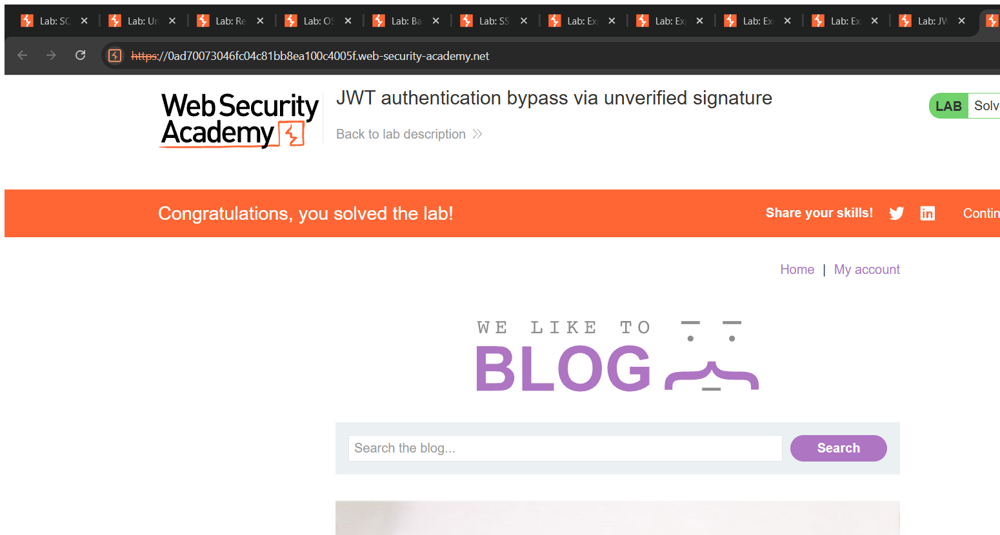
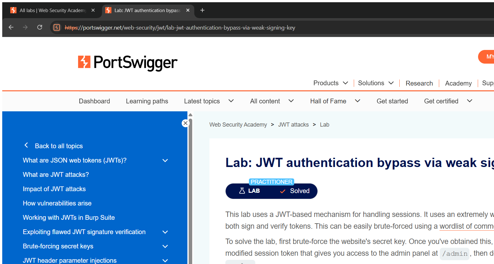

# JWT Attacks — Technical Writeups

> Topic requirement: at least 6 labs solved, at least 2 technical writeups.

---

## Writeup 1 — JWT authentication bypass via unverified signature

**Vulnerability Name:** JWT Signature Not Verified
**Lab:** JWT authentication bypass via unverified signature
**Lab URL:** https://portswigger.net/web-security/jwt/lab-jwt-authentication-bypass-via-unverified-signature

### Description
The application uses a JWT to store the logged-in user's identity (`sub` claim) but **does not verify the token's signature**. That means I can change the payload — for example set `sub` to `administrator` — and the server accepts the tampered token. This grants access to the admin panel without the admin's credentials.

### Steps to Exploit
1. Log in as `wiener : peter` and capture the `session` JWT.
2. Base64url-decode the payload, change `"sub":"wiener"` to `"sub":"administrator"`, and re-encode it (the signature can be left as-is or emptied because it isn't checked).
3. Send a request to `/admin` with the modified token.
4. Access is granted; delete user `carlos` via the admin panel. Lab solved.

### Proof of Concept
**Modified payload:**
```json
{ "iss": "portswigger", "sub": "administrator" }
```
The server reads `sub=administrator` without validating the signature, so the forged token is trusted.

### Screenshot


### Impact
- **Authentication Bypass / Privilege Escalation** — impersonate any user, including the administrator.

### Recommended Remediation
- Always **verify the JWT signature** with the correct key before trusting any claim.
- Reject tokens with `alg: none` or unexpected algorithms.

### CVSS
**CVSS v3.1: 8.8 (High)** — `AV:N/AC:L/PR:L/UI:N/S:U/C:H/I:H/A:H`
Requires a starting low-privileged account but yields administrator access.

---

## Writeup 2 — JWT authentication bypass via weak signing key

**Vulnerability Name:** JWT Weak HMAC Secret (brute-forceable key)
**Lab:** JWT authentication bypass via weak signing key
**Lab URL:** https://portswigger.net/web-security/jwt/lab-jwt-authentication-bypass-via-weak-signing-key

### Description
The JWT is signed with **HS256** using a weak, guessable secret. Because HMAC secrets can be brute-forced offline against a captured token, I cracked the secret using a wordlist of common JWT keys, then used it to **forge** a validly-signed token with `sub: administrator`. Since the signature now verifies correctly, the server fully trusts the forged token.

### Steps to Exploit
1. Capture a valid JWT from the logged-in session.
2. Crack the HMAC secret offline (wordlist of common JWT secrets) — the secret is `secret1`.
3. Forge a new token: same header, payload with `"sub":"administrator"`, signed using HS256 with the cracked secret.
4. Send it to `/admin`, delete `carlos`. Lab solved.

### Proof of Concept
- Cracked signing key: `secret1`
- Forged payload: `{ "iss":"portswigger", "sub":"administrator" }`, signed HS256 with `secret1`.

### Screenshot


### Impact
- **Authentication Bypass / Privilege Escalation** — forge arbitrary trusted tokens once the secret is known.

### Recommended Remediation
- Use a **long, high-entropy random secret** (or asymmetric keys) for signing.
- Rotate keys and never use dictionary words as signing secrets.

### CVSS
**CVSS v3.1: 8.8 (High)** — `AV:N/AC:L/PR:L/UI:N/S:U/C:H/I:H/A:H`
Full token forgery enabling administrator impersonation.
