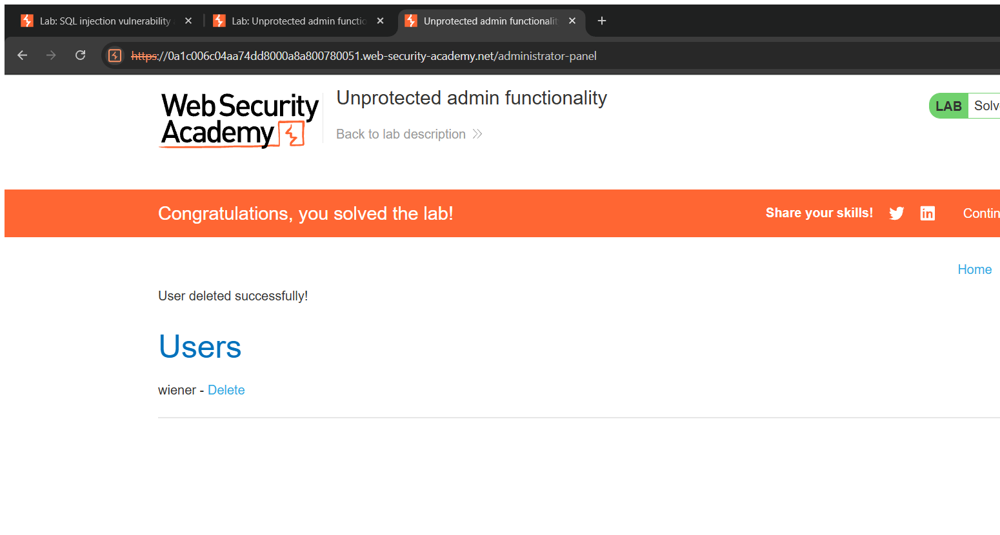
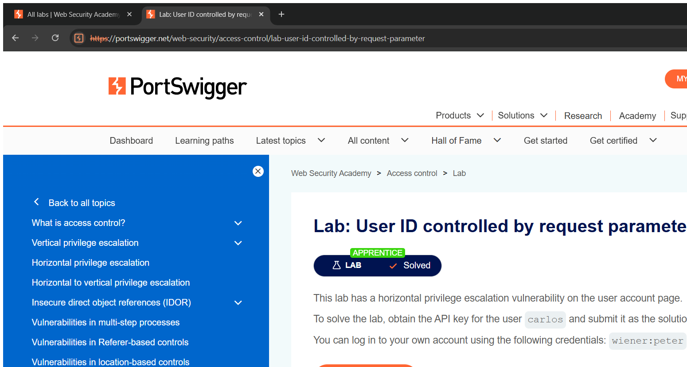

# Authorization / Access Control — Technical Writeups

> Topic requirement: at least 10 labs solved, at least 2 technical writeups.

---

## Writeup 1 — Unprotected admin functionality

**Vulnerability Name:** Broken Access Control (unprotected admin panel)
**Lab:** Unprotected admin functionality
**Lab URL:** https://portswigger.net/web-security/access-control/lab-unprotected-admin-functionality

### Description
The administrative panel is reachable by **anyone** who knows its URL — there is no authentication or authorization check on the admin endpoint. The location is even disclosed in `robots.txt`. This is a classic broken-access-control issue where security depends only on the URL being secret ("security through obscurity").

### Steps to Exploit
1. Request `/robots.txt` — it discloses the admin path `/administrator-panel`.
2. Browse directly to `/administrator-panel` — it loads with no login required.
3. Use the panel to delete user `carlos`. Lab solved.

### Proof of Concept
```
GET /robots.txt          → reveals "Disallow: /administrator-panel"
GET /administrator-panel → admin panel loads (no auth)
GET /administrator-panel/delete?username=carlos → carlos deleted
```

### Screenshot


### Impact
- **Privilege Escalation / Broken Access Control** — unauthenticated users gain full administrative control.

### Recommended Remediation
- Enforce **server-side authorization** on every administrative function (verify the user holds an admin role).
- Never rely on hidden URLs; deny by default.

### CVSS
**CVSS v3.1: 9.8 (Critical)** — `AV:N/AC:L/PR:N/UI:N/S:U/C:H/I:H/A:H`
Unauthenticated administrative access.

---

## Writeup 2 — User ID controlled by request parameter (IDOR)

**Vulnerability Name:** Insecure Direct Object Reference (IDOR)
**Lab:** User ID controlled by request parameter
**Lab URL:** https://portswigger.net/web-security/access-control/lab-user-id-controlled-by-request-parameter

### Description
The "My account" page selects which user's data to show based on an `id` parameter in the URL, and the server does **not** check that the requested `id` belongs to the logged-in user. By changing `id` to another username I can view that user's account page, including their API key — a horizontal privilege escalation / IDOR.

### Steps to Exploit
1. Log in as `wiener` and open `My account` — the URL is `/my-account?id=wiener`.
2. Change the parameter to `/my-account?id=carlos`.
3. The page returns Carlos's account data, including his API key. Submit the key to solve the lab.

### Proof of Concept
```
GET /my-account?id=carlos
```
The server returns Carlos's data because it trusts the client-supplied `id` without an ownership check.

### Screenshot


### Impact
- **Broken Access Control / Information Disclosure** — read or modify other users' data by changing an identifier.

### Recommended Remediation
- Enforce **object-level authorization**: confirm the authenticated user owns (or may access) the requested object server-side.
- Use unpredictable identifiers as defence-in-depth (not as the only control).

### CVSS
**CVSS v3.1: 6.5 (Medium)** — `AV:N/AC:L/PR:L/UI:N/S:U/C:H/I:N/A:N`
Authenticated user reads another user's sensitive data.
