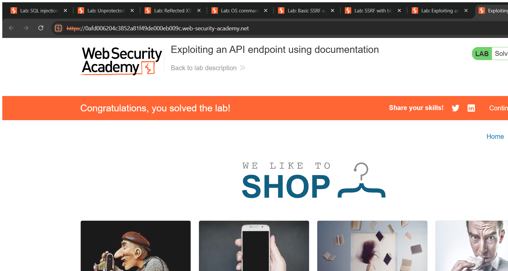
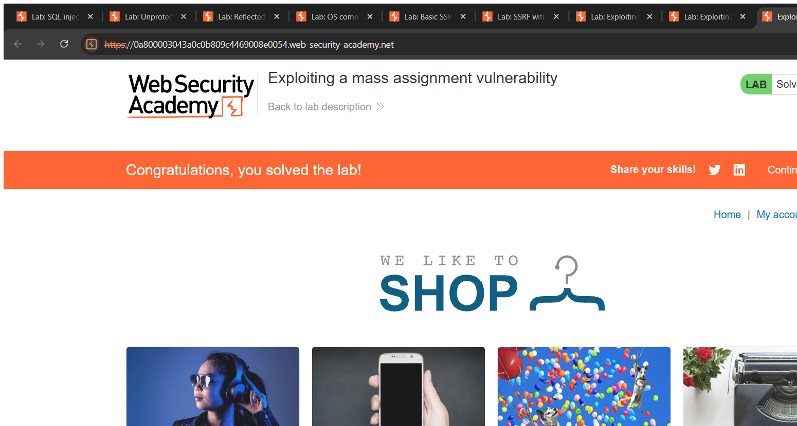

# API Testing — Technical Writeups

> Topic requirement: at least 3 labs solved, at least 2 technical writeups.

---

## Writeup 1 — Exploiting an API endpoint using documentation

**Vulnerability Name:** Broken Function Level Authorization via exposed API docs
**Lab:** Exploiting an API endpoint using documentation
**Lab URL:** https://portswigger.net/web-security/api-testing/lab-exploiting-api-endpoint-using-documentation

### Description
The application exposes a REST API and its **interactive documentation** (a Swagger/OpenAPI UI) at `/api`. The docs reveal a `DELETE /api/user/{username}` method. There is no proper authorization preventing a low-privileged user from calling this destructive endpoint, so I can delete any account directly through the API.

### Steps to Exploit
1. Log in as `wiener : peter` and notice the account email update calls `/api/user`.
2. Browse to `/api/` — the Swagger UI loads and documents the available methods, including `DELETE /api/user/{username}`. (`GET /api/user/wiener` returns the user record, confirming the schema.)
3. Send `DELETE /api/user/carlos`.
4. Response: `{"status":"User deleted"}` — lab solved.

### Proof of Concept
```
DELETE /api/user/carlos
→ 200 {"status":"User deleted"}
```

### Screenshot


### Impact
- **Broken Access Control / Data Integrity** — any user can invoke privileged API actions (delete accounts), enabling destructive and unauthorized operations.

### Recommended Remediation
- Enforce **authorization checks on every API method**, especially destructive ones.
- Do not expose interactive API documentation in production, or restrict it.

### CVSS
**CVSS v3.1: 8.1 (High)** — `AV:N/AC:L/PR:L/UI:N/S:U/C:N/I:H/A:H`
Low-privileged user performs unauthorized destructive actions on other accounts.

---

## Writeup 2 — Exploiting a mass assignment vulnerability

**Vulnerability Name:** Mass Assignment (over-binding)
**Lab:** Exploiting a mass assignment vulnerability
**Lab URL:** https://portswigger.net/web-security/api-testing/lab-exploiting-mass-assignment-vulnerability

### Description
The checkout API binds the incoming JSON body directly onto the internal order object. The `GET /api/checkout` response reveals a hidden field — `chosen_discount` — that the normal UI never sends. Because the API blindly accepts whatever fields I include in the `POST` body (mass assignment), I can add `chosen_discount` with a 100% value and buy the expensive item for free.

### Steps to Exploit
1. Log in, add the leather jacket to the cart.
2. Send `GET /api/checkout` and observe the JSON contains `"chosen_discount":{"percentage":0}` alongside `chosen_products`.
3. Send `POST /api/checkout` (JSON) including the hidden discount field set to 100%.
4. Order completes for free (`201` → order confirmed). Lab solved.

### Proof of Concept
**POST /api/checkout body:**
```json
{"chosen_discount":{"percentage":100},"chosen_products":[{"product_id":"1","quantity":1}]}
```
The server applies the attacker-supplied 100% discount because the field is bound automatically.

### Screenshot


### Impact
- **Business Logic / Integrity** — manipulate hidden server-side fields (prices, discounts, roles), causing financial loss or privilege escalation.

### Recommended Remediation
- Bind only an **explicit allow-list** of client-settable fields (DTOs); never auto-bind the whole request to internal objects.
- Validate price/discount **server-side** from trusted data.

### CVSS
**CVSS v3.1: 7.1 (High)** — `AV:N/AC:L/PR:L/UI:N/S:U/C:N/I:H/A:N`
Authenticated user manipulates server-side order data for financial gain.
