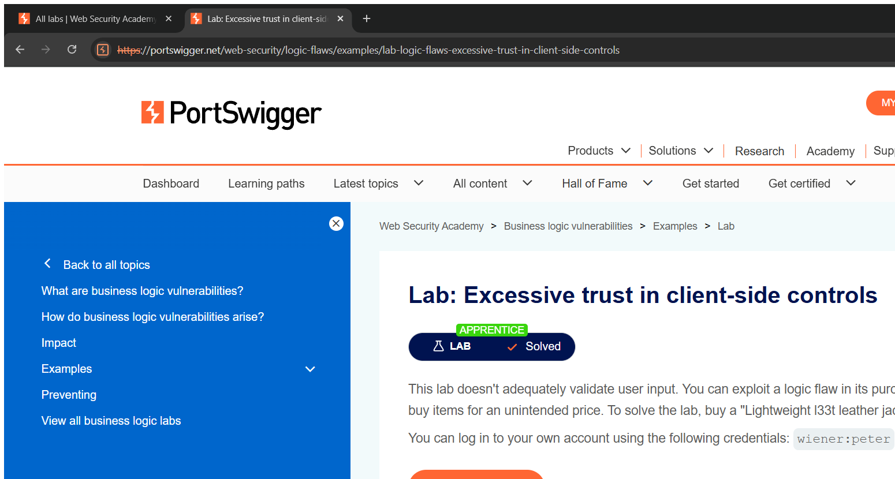
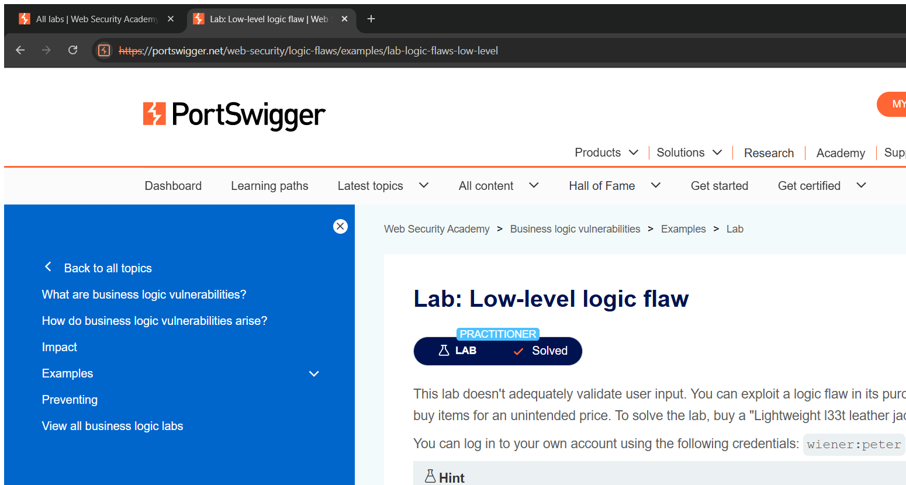

# Business Logic Vulnerabilities — Technical Writeups

> Topic requirement: at least 7 labs solved, at least 2 technical writeups.

---

## Writeup 1 — Excessive trust in client-side controls

**Vulnerability Name:** Excessive Trust in Client-Side Controls (price tampering)
**Lab:** Excessive trust in client-side controls
**Lab URL:** https://portswigger.net/web-security/logic-flaws/examples/lab-logic-flaws-excessive-trust-in-client-side-controls

### Description
When adding a product to the cart, the **price is sent from the client** in the `POST /cart` request and the server trusts it instead of looking the price up from its own database. By intercepting the request and changing the `price` value, I can buy an expensive item for any amount I choose.

### Steps to Exploit
1. Log in as `wiener : peter` (store credit $100). View the leather jacket ($1337) — note the add-to-cart form contains a hidden `price` field.
2. Add to cart and intercept `POST /cart`; change `price=133700` (cents) to a tiny value such as `price=1`.
3. Complete checkout — the order is accepted at the tampered price. Lab solved.

### Proof of Concept
**POST /cart body:**
```
productId=1&redir=PRODUCT&quantity=1&price=1
```
The server records the $0.01 price supplied by the client, so the $1337 jacket is purchased for one cent.

### Screenshot


### Impact
- **Business Logic Flaw / Financial Loss** — purchase goods below their real price; integrity of pricing is broken.

### Recommended Remediation
- Treat all client input as untrusted: **derive prices server-side** from the product catalogue, never from the request.

### CVSS
**CVSS v3.1: 7.1 (High)** — `AV:N/AC:L/PR:L/UI:N/S:U/C:N/I:H/A:N`
Authenticated user manipulates pricing for financial gain.

---

## Writeup 2 — Low-level logic flaw (integer overflow)

**Vulnerability Name:** Low-Level Logic Flaw (signed integer overflow on order total)
**Lab:** Low-level logic flaw
**Lab URL:** https://portswigger.net/web-security/logic-flaws/examples/lab-logic-flaws-low-level

### Description
The order total is stored in a **signed 32-bit integer** of cents, and the per-request quantity is capped at 99 but the cart can be added to repeatedly. By adding the jacket thousands of times, the total exceeds the maximum 32-bit value (2,147,483,647) and **wraps around to a negative number**. I then top the total up with a cheap item until it lands at a small positive value within my store credit, and check out.

### Steps to Exploit
1. Add the jacket ($1337 = 133700 cents) 99 at a time. After ~32,123 jackets the signed total overflows and reads **-$1221.96**.
2. Add a cheap product (85¢) ×1438 — the total wraps again to a small positive **$0.34**.
3. The total ($0.34) is now below my store credit, so checkout succeeds. Lab solved.

### Proof of Concept
```
32,123 × jacket (133700c)  → total = -$1221.96   (signed 32-bit overflow)
+ 1,438 × item (85c)       → total = +$0.34      (wraps back into payable range)
→ checkout succeeds
```

### Screenshot


### Impact
- **Business Logic Flaw** — defeat price/credit checks via arithmetic overflow, obtaining goods effectively for free.

### Recommended Remediation
- Use appropriate numeric types and **reject negative or overflowing totals**; validate quantity and total ranges server-side.
- Enforce sane per-item and per-order quantity limits.

### CVSS
**CVSS v3.1: 5.3 (Medium)** — `AV:N/AC:H/PR:L/UI:N/S:U/C:N/I:H/A:N`
Requires effort (many requests) but reliably bypasses payment integrity.
