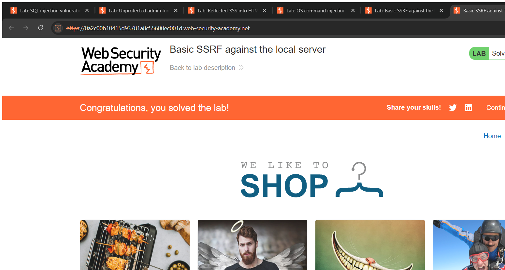
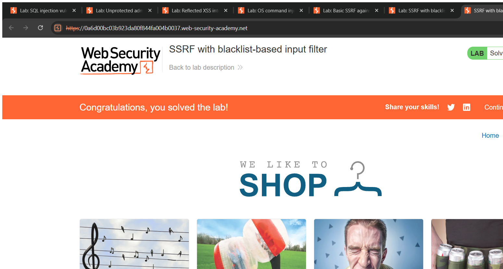

# Server-Side Request Forgery (SSRF) — Technical Writeups

> Topic requirement: at least 5 labs solved, at least 2 technical writeups.

---

## Writeup 1 — Basic SSRF against the local server

**Vulnerability Name:** Server-Side Request Forgery (access to localhost)
**Lab:** Basic SSRF against the local server
**Lab URL:** https://portswigger.net/web-security/ssrf/lab-basic-ssrf-against-localhost

### Description
The stock-check feature fetches a URL **supplied by the client** (`stockApi`) from a back-end system, and the server does not restrict which URL it will request. By replacing the legitimate stock URL with `http://localhost/admin`, I make the server request its own internal admin interface — which is only accessible from localhost — and then use it to delete a user.

### Steps to Exploit
1. On a product page click **Check stock** and capture `POST /product/stock`; note the `stockApi` parameter contains a full URL.
2. Change `stockApi` to `http://localhost/admin` — the response returns the internal admin page (normally blocked to external users).
3. Change it to the admin delete URL to remove `carlos`. Lab solved.

### Proof of Concept
```
stockApi=http://localhost/admin                          → internal admin panel returned
stockApi=http://localhost/admin/delete?username=carlos   → carlos deleted (302)
```

### Screenshot


### Impact
- **SSRF / Broken Access Control** — reach internal-only services and perform privileged actions through the trusted server.

### Recommended Remediation
- **Allow-list** the exact hosts/URLs the server may fetch; reject everything else.
- Do not send raw user-supplied URLs to the request library; block internal ranges/localhost at the network layer.

### CVSS
**CVSS v3.1: 8.6 (High)** — `AV:N/AC:L/PR:N/UI:N/S:C/C:H/I:H/A:N`
Unauthenticated access to internal admin functionality; scope changes as it reaches protected internal services.

---

## Writeup 2 — SSRF with blacklist-based input filter

**Vulnerability Name:** SSRF with filter bypass (blacklist evasion)
**Lab:** SSRF with blacklist-based input filter
**Lab URL:** https://portswigger.net/web-security/ssrf/lab-ssrf-with-blacklist-filter

### Description
This stock checker also fetches a client URL, but the developer added two weak **blacklist** defences: it blocks the strings `localhost` / `127.0.0.1`, and it blocks the path `/admin`. Blacklists are brittle — there are many equivalent ways to write the same address and path. I bypass the host filter with the shorthand `127.1` and the path filter with double-URL-encoding of a character in "admin".

### Steps to Exploit
1. Confirm `http://localhost/admin` and `http://127.1/admin` are both blocked (400, "blocked for security reasons").
2. Bypass both filters with an alternative loopback notation and a double-encoded `a` in `admin`.
3. The admin panel is returned; repeat against the delete URL to remove `carlos`. Lab solved.

### Proof of Concept
```
stockApi=http://127.1/%2561dmin                         → admin panel returned (200)
stockApi=http://127.1/%2561dmin/delete?username=carlos  → carlos deleted (302)
```
`127.1` resolves to `127.0.0.1` but isn't on the blacklist; `%2561` decodes once to `%61` then to `a`, so the filter never sees the literal string `admin` while the back-end still requests `/admin`.

### Screenshot


### Impact
- **SSRF / Broken Access Control** — the same internal-admin compromise as the basic case, despite filter-based defences.

### Recommended Remediation
- Replace blacklists with a strict **allow-list** of permitted hosts.
- Canonicalise and re-validate the URL **after** decoding; block internal addresses at the network layer.

### CVSS
**CVSS v3.1: 8.6 (High)** — `AV:N/AC:L/PR:N/UI:N/S:C/C:H/I:H/A:N`
Trivial filter bypass yielding internal admin access.
